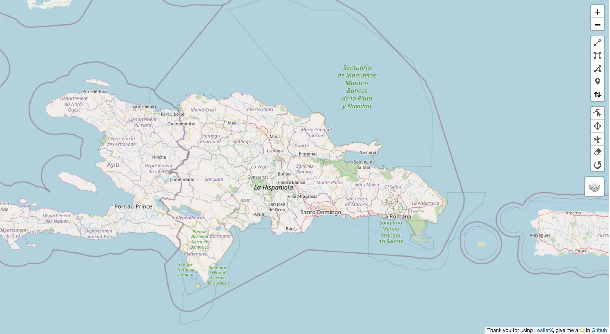

<a name="readme-top"></a>

<!-- PROJECT SHIELDS -->

[![Contributors][contributors-shield]][contributors-url]
[![Forks][forks-shield]][forks-url]
[![Stargazers][stars-shield]][stars-url]
[![Issues][issues-shield]][issues-url]
[![MIT License][license-shield]][license-url]
[![LinkedIn][linkedin-shield]][linkedin-url]

<!-- PROJECT LOGO -->
<br />
<div align="center">
  <a href="https://github.com/Seventty/leaflet-x">
    
  </a>

  <h3 align="center">Superset Angular leaflet toolkit supercharged with geoman</h3>

  <p align="center">
    Just a set of tools adapted to Angular to draw shapes in a leaflet map.
    <br />
    <a href="https://github.com/Seventty/leaflet-x"><strong>Explore the docs »</strong></a>
    <br />
    <br />
    <a href="https://github.com/seventty/leaflet-x">View Demo</a> ·
    <a href="https://github.com/Seventty/leaflet-x/issues/new?assignees=&labels=bug&projects=&template=bug-report-%F0%9F%90%9E.md&title=">Report Bug</a> ·
    <a href="https://github.com/Seventty/leaflet-x/issues/new?assignees=&labels=enhancement&projects=&template=feature-request-%F0%9F%9A%80.md&title=">Request Feature</a>
  </p>
</div>

<!-- TABLE OF CONTENTS -->
<details>
  <summary>Table of Contents</summary>
  <ol>
    <li>
      <a href="#about-the-project">About The Project</a>
      <ul>
        <li><a href="#built-with">Built With</a></li>
      </ul>
    </li>
    <li>
      <a href="#getting-started">Getting Started</a>
      <ul>
        <li><a href="#prerequisites">Prerequisites</a></li>
        <li><a href="#installation">Installation</a></li>
      </ul>
    </li>
    <li><a href="#usage">Usage</a></li>
    <li><a href="#roadmap">Roadmap</a></li>
    <li><a href="#contributing">Contributing</a></li>
    <li><a href="#license">License</a></li>
    <li><a href="#contact">Contact</a></li>
    <li><a href="#acknowledgments">Acknowledgments</a></li>
  </ol>
</details>

<!-- ABOUT THE PROJECT -->

## About The Project



For a long time working with map development with Leaflet and Angular, I've noticed that a lot of time is wasted setting up a map completely from scratch and looking for all the third-party libraries we need to achieve some magic tricks with the drawings and some additional configurations, import some map files and export files from the drawed map layer.

Here's why:

- Your time should be focused on creating something incredibly useful with maps. A base project that solves a problem and is beneficial to your overall project.
- You shouldn't set up a whole map from scratch every time you start a project.
- You shouldn't have to remember all the third-party libraries that are required as plugins to have a powerful map tool.

<p align="right">(<a href="#readme-top">back to top</a>)</p>

### Built With

- [![Angular][Angular.io]][Angular-url]
- [![LeafletX][LeafletX.com]][LeafletX-url]
- [![Bootstrap][Bootstrap.com]][Bootstrap-url]
- [![NgBootstrap][NgBootstrap.com]][NgBootstrap-url]

<p align="right">(<a href="#readme-top">back to top</a>)</p>

<!-- GETTING STARTED -->

## Getting Started

To integrate LeafletX we will not need many steps, follow the steps below to configure LeafletX in your project.

### Prerequisites

> Angular version 15 or higher is required.

> NgBootstrap library is required if you don´t have it.

- npm
  ```sh
  npm install npm@latest -g
  npm install @angular/cli -g
  ng add @ng-bootstrap/ng-bootstrap
  ```

### Installation

1. Install the dependency [Leaflet-x](<[Leaflet-x](https://www.npmjs.com/package/@seventty/leaflet-x)>)
2. Use the command
   ```npm
   npm install @seventty/leaflet-x
   ```
3. Add the _LeafletXModule_ into your component module imports section.
   ```ts
   @NgModule({
   declarations: [
    AppComponent,
   ],
   imports: [
    LeafletXModule
   ],
   providers: [],
   })
   ```
4. Use it in your component as well as common custom component.
   ```html
   <leaflet-x></leaflet-x>
   ```

<p align="right">(<a href="#readme-top">back to top</a>)</p>

<!-- USAGE EXAMPLES -->

## Usage

leaflet-x is quite flexible and was developed thinking about most of the needs that may arise when working with maps. Here are some of the inputs and modules:

### Inputs / Outputs

| Decorator | Name                    | Type          | Description                                                                                                                                                                                                                                                                                                                                                                    |
| --------- | ----------------------- | ------------- | ------------------------------------------------------------------------------------------------------------------------------------------------------------------------------------------------------------------------------------------------------------------------------------------------------------------------------------------------------------------------------ |
| @Input    | featureCollectionInput  | GeoJsonResult | This @Input receives an object of type GeoJsonResult, which is nothing more than the structure of a FeatureCollection or a GeoJson, you could say that it is the same structure of a drawing object that is already exported in GeoJson format. You can see such an object if you draw a figure and export it with the export file module and export a GeoJson of the drawing. |
| @Input    | prefix                  | string        | This will write a footer on the map, it is often used to put @copyright messages.                                                                                                                                                                                                                                                                                              |
| @Input    | watermarkImagePath      | string        | This @Input receives a path (preferably from the assets folder) in which you can call an image you have in that folder, to draw the image on the map (preferably an image with transparency).                                                                                                                                                                                  |
| @Input    | readonly                | boolean       | Enable or disable the toolbar utility to draw or not.                                                                                                                                                                                                                                                                                                                          |
| @Input    | mainColor               | #{string}     | Set this input if you want to set a shape color. Blue shape color is default, but you can set a custom color, eg: **#ffcc66**                                                                                                                                                                                                                                                  |
| @Output   | featureCollectionOutput | GeoJsonResult | This is part of I/O mainstream, emits every action made in the map                                                                                                                                                                                                                                                                                                             |

Example

```html
<leaflet-x prefix="@Copyright give me a star in GH" watermarkImagePath="assets/exampleImage.png" mainColor="#00ff00" (featureCollectionOutput)="watchFeatureCollectionOutput($event)"></leaflet-x>
```

### Modules

<p align="right">(<a href="#readme-top">back to top</a>)</p>

<!-- ROADMAP -->

## Roadmap

- [x] Custom toolbar
- [x] Map events emitter
- [x] Input/Output file/s modules
- [x] Custom base layer switcher
- [ ] Multi-language Support
  - [ ] English
  - [ ] Chinese
  - [ ] Portuguese
  - [ ] Russian

See the [open issues](https://github.com/seventty/leaflet-x/issues) for a full list of proposed features (and known issues).

<p align="right">(<a href="#readme-top">back to top</a>)</p>

<!-- CONTRIBUTING -->

## Contributing

Contributions are what make the open source community such an amazing place to learn, inspire, and create. Any contributions you make are **greatly appreciated**.

If you have a suggestion that would make this better, please fork the repo and create a pull request. You can also simply open an issue with the tag "enhancement".
Don't forget to give the project a star! Thanks again!

1. Fork the Project
2. Create your Feature Branch (`git checkout -b feature/AmazingFeature`)
3. Commit your Changes (`git commit -m 'Add some AmazingFeature'`)
4. Push to the Branch (`git push origin feature/AmazingFeature`)
5. Open a Pull Request

<p align="right">(<a href="#readme-top">back to top</a>)</p>

<!-- LICENSE -->

## License

Distributed under the MIT License. See `LICENSE.txt` for more information.

<p align="right">(<a href="#readme-top">back to top</a>)</p>

<!-- CONTACT -->

## Contact

Your Name - [@your_twitter](https://twitter.com/your_username) - email@example.com

Project Link: [https://github.com/your_username/repo_name](https://github.com/your_username/repo_name)

<p align="right">(<a href="#readme-top">back to top</a>)</p>

<!-- ACKNOWLEDGMENTS -->

## Acknowledgments

Use this space to list resources you find helpful and would like to give credit to. I've included a few of my favorites to kick things off!

- [Choose an Open Source License](https://choosealicense.com)
- [GitHub Emoji Cheat Sheet](https://www.webpagefx.com/tools/emoji-cheat-sheet)
- [Malven's Flexbox Cheatsheet](https://flexbox.malven.co/)
- [Malven's Grid Cheatsheet](https://grid.malven.co/)
- [Img Shields](https://shields.io)
- [GitHub Pages](https://pages.github.com)
- [Font Awesome](https://fontawesome.com)
- [React Icons](https://react-icons.github.io/react-icons/search)

<p align="right">(<a href="#readme-top">back to top</a>)</p>

<!-- MARKDOWN LINKS & IMAGES -->
<!-- https://www.markdownguide.org/basic-syntax/#reference-style-links -->

[contributors-shield]: https://img.shields.io/github/contributors/seventty/leaflet-x.svg?style=for-the-badge
[contributors-url]: https://github.com/seventty/leaflet-x/graphs/contributors
[forks-shield]: https://img.shields.io/github/forks/seventty/leaflet-x.svg?style=for-the-badge
[forks-url]: https://github.com/seventty/leaflet-x/network/members
[stars-shield]: https://img.shields.io/github/stars/seventty/leaflet-x.svg?style=for-the-badge
[stars-url]: https://github.com/seventty/leaflet-x/stargazers
[issues-shield]: https://img.shields.io/github/issues/seventty/leaflet-x.svg?style=for-the-badge
[issues-url]: https://github.com/seventty/leaflet-x/issues
[license-shield]: https://img.shields.io/github/license/seventty/leaflet-x.svg?style=for-the-badge
[license-url]: https://github.com/seventty/leaflet-x/blob/master/LICENSE.txt
[linkedin-shield]: https://img.shields.io/badge/-LinkedIn-black.svg?style=for-the-badge&logo=linkedin&colorB=555
[linkedin-url]: https://linkedin.com/in/seventty
[product-screenshot]: images/screenshot.png
[Next.js]: https://img.shields.io/badge/next.js-000000?style=for-the-badge&logo=nextdotjs&logoColor=white
[Next-url]: https://nextjs.org/
[React.js]: https://img.shields.io/badge/React-20232A?style=for-the-badge&logo=react&logoColor=61DAFB
[React-url]: https://reactjs.org/
[Vue.js]: https://img.shields.io/badge/Vue.js-35495E?style=for-the-badge&logo=vuedotjs&logoColor=4FC08D
[Vue-url]: https://vuejs.org/
[Angular.io]: https://img.shields.io/badge/Angular-DD0031?style=for-the-badge&logo=angular&logoColor=white
[Angular-url]: https://angular.io/
[Svelte.dev]: https://img.shields.io/badge/Svelte-4A4A55?style=for-the-badge&logo=svelte&logoColor=FF3E00
[Svelte-url]: https://svelte.dev/
[Laravel.com]: https://img.shields.io/badge/Laravel-FF2D20?style=for-the-badge&logo=laravel&logoColor=white
[Laravel-url]: https://laravel.com
[Bootstrap.com]: https://img.shields.io/badge/Bootstrap-563D7C?style=for-the-badge&logo=bootstrap&logoColor=white
[Bootstrap-url]: https://getbootstrap.com
[NgBootstrap.com]: https://img.shields.io/badge/NgBootstrap-563D7C?style=for-the-badge&logo=bootstrap&logoColor=white
[NgBootstrap-url]: https://ng-bootstrap.github.io/#/home
[JQuery.com]: https://img.shields.io/badge/jQuery-0769AD?style=for-the-badge&logo=jquery&logoColor=white
[JQuery-url]: https://jquery.com
[LeafletX.com]: https://img.shields.io/badge/LeafletX-141321?style=for-the-badge&logo=leafletx&logoColor=B1DE5C
[LeafletX-url]: https://github.com/seventty/leafletX
